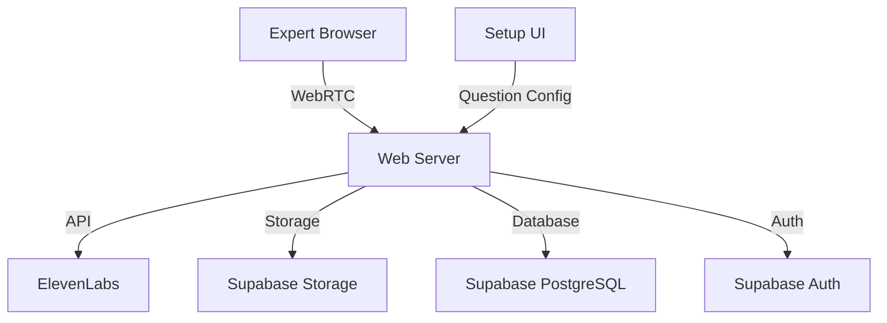

# InterviewBot - AI-Powered Expert Interview Platform

## Product Overview
InterviewBot is a lightweight web-based platform that facilitates automated voice interviews between an AI interviewer and subject matter experts. The platform uses the official ElevenLabs SDK for voice synthesis and transcription, creating a natural conversational experience while capturing valuable expert knowledge through automated interviews. Each interview is conducted with a consistent AI voice personality, allowing for follow-up questions and branching conversation paths based on responses.

## Core Features

### 1. Interview Management
- Custom interview link generation for each expert
- Simple UI form for configuring interview questions, including:
  - Main questions
  - Follow-up questions
  - Branching logic based on responses
- Secure, single-use interview links
- Expected interview duration: 20-30 minutes
- Low volume handling (approximately 5 interviews per month)

### 2. Voice Interaction
- Real-time voice synthesis using ElevenLabs SDK
- Built-in volume controls and audio visualization
- Consistent voice personality across all interviews
- Natural conversation flow with:
  - Dynamic follow-up questions
  - Branching dialogue paths
  - Appropriate pausing and turn-taking
- Voice selection via ElevenLabs SDK

### 3. Recording & Transcription
- High-quality audio recording of entire interview
- Post-interview transcription via ElevenLabs
- Automated email delivery of:
  - Audio recording (MP3)
  - Interview transcript
  - Interview metadata (JSON)
  - Plain text export (TXT)

### 4. Interview Experience
- Preparation phase:
  - Audio setup and testing
  - Preview of interview questions
  - Connection verification
- Interview controls:
  - Pause/Resume functionality
  - Audio level indicators
  - Progress tracking
- Clear, distraction-free interface

## Technical Requirements

### Frontend
- **Framework & Core Technologies**
  - React.js with TypeScript for type safety
  - Vite for build tooling and development
  - TailwindCSS with Shadcn UI components
  - React Router v6 with Data Router API
  - ElevenLabs SDK for voice synthesis

- **Audio Processing**
  - ElevenLabs SDK for real-time audio streaming
  - Built-in volume controls and visualization
  - Background noise detection
  - Audio quality monitoring

- **State Management**
  - React Context for global state
  - Local storage for interview progress
  - Custom hooks for audio handling

- **UI Components**
  - Audio level visualizer
  - Progress indicator
  - Question preview panel
  - Pause/Resume controls
  - Error handling modals
  - Loading states and animations

- **Browser Compatibility**
  - Support for latest versions of Chrome, Firefox, Safari
  - Graceful fallbacks for unsupported features
  - Responsive design for desktop and tablet

### Backend
- **Core Server**
  - Node.js with Express
  - TypeScript for type safety
  - RESTful API design
  - WebSocket support for real-time communication

- **Supabase Infrastructure**

  - Authentication and user management
  - PostgreSQL database for structured data
  - Storage for audio files and transcripts
  - Real-time subscriptions
  - Row Level Security (RLS)
  - Edge Functions for serverless compute

- **Database Schema**
  - Interview configurations
  - Question sets
  - Session metadata
  - Completion status
  - Audio recordings and transcripts

- **Authentication & Security**
  - UUID-based interview links
  - Rate limiting
  - CORS configuration
  - Helmet.js for security headers
  - Environment variable management

- **File Processing**
  - Multer for file uploads
  - Sharp for image processing (if needed)
  - Supabase Storage for file operations
  - Stream processing for large files

### APIs & External Services
- **ElevenLabs Integration**
  - Official ElevenLabs SDK implementation
  - Built-in voice synthesis and streaming
  - Automatic error handling and retries
  - Rate limit monitoring
  - Volume control and audio visualization
  - WebSocket management handled by SDK

- **Supabase Integration**
  - Storage bucket management
  - Database operations
  - Real-time subscriptions
  - Edge Functions
  - Row Level Security policies

### Data Models

```typescript
// Interview Configuration
interface InterviewConfig {
  id: string;
  createdAt: Date;
  voiceId: string;
  questions: Question[];
  metadata: {
    expectedDuration: number;
    intervieweeEmail?: string;
    customFields: Record<string, string>;
  }
}

// Question Structure
interface Question {
  id: string;
  text: string;
  type: 'main' | 'followup' | 'branch';
  branchingLogic?: {
    condition: string;
    nextQuestionId: string;
  };
  followUps?: Question[];
}

// Interview Session
interface InterviewSession {
  id: string;
  configId: string;
  status: 'pending' | 'in-progress' | 'paused' | 'completed';
  startTime?: Date;
  endTime?: Date;
  currentQuestionId?: string;
  audioUrl?: string;
  transcriptUrl?: string;
}
```

### API Endpoints

```typescript
// Interview Management
POST   /api/interviews           // Create new interview
GET    /api/interviews/:id       // Get interview config
PUT    /api/interviews/:id       // Update interview config
DELETE /api/interviews/:id       // Delete interview

// Session Management
POST   /api/sessions            // Start new session
PUT    /api/sessions/:id        // Update session state
PUT    /api/sessions/:id/pause  // Pause session
PUT    /api/sessions/:id/resume // Resume session
POST   /api/sessions/:id/complete // Complete session

// Audio Processing
POST   /api/audio/upload        // Upload audio chunk
GET    /api/audio/:id           // Get processed audio
POST   /api/transcripts/generate // Generate transcript
```

### Environment Variables
```bash
# Server Configuration
PORT=3000
NODE_ENV=development
API_BASE_URL=http://localhost:3000

# Supabase Configuration
VITE_SUPABASE_URL=your_supabase_url
VITE_SUPABASE_ANON_KEY=your_supabase_anon_key
SUPABASE_SERVICE_ROLE_KEY=your_service_role_key

# ElevenLabs Configuration
VITE_ELEVEN_LABS_API_KEY=your_eleven_labs_key
```

### Deployment Pipeline
- **Development**
  - Local development with hot reload
  - ESLint + Prettier for code quality
  - Jest for unit testing
  - Cypress for E2E testing

- **Staging**
  - Automated builds on PR
  - Integration tests
  - Performance testing
  - Security scanning

- **Production**
  - Vercel deployment
  - Supabase database migrations
  - Automated backups
  - Error monitoring

## User Flow

1. **Interview Setup**
   - Create interview questions via UI form
   - Configure branching logic
   - Select ElevenLabs voice
   - Generate and send unique interview link

2. **Expert Experience**
   - Click unique interview link
   - Review interview questions
   - Complete audio setup and testing
   - Begin interview with AI
   - Pause/Resume as needed
   - Complete interview

3. **Post-Interview**
   - Automatic processing of recording
   - Email delivery of all assets
   - Basic analytics (duration)

## Data Exports
- MP3 audio recording
- JSON format (interview metadata, Q&A structure)
- TXT transcript
- CSV summary (optional)

## Development Phases

### Phase 1 - MVP
- Basic interview functionality
- ElevenLabs integration
- Simple recording and storage
- Essential user interface
- Question preview
- Pause/Resume capability

### Phase 2 - Enhancement (Future)
- User authentication with Supabase
- Advanced branching logic
- Enhanced analytics
- Interview dashboard
- Custom voice profiles

## Technical Architecture


## Success Metrics
- Interview completion rate
- Audio quality
- Average interview duration
- System reliability
- Expert satisfaction

## Maintenance
- Regular Supabase database monitoring
- ElevenLabs API status tracking
- Basic error logging
- Weekly backups

## Development Plan

### Phase 1: Foundation Setup (Completed)
✅ Project initialization
- Basic React + TypeScript + Vite setup
- TailwindCSS configuration
- Project structure
- Dependencies installation

✅ Basic component structure
- App component
- Interview page
- NotFound page
- Loading spinner

### Phase 2: Audio Foundation (Completed)
1. **Audio Recording Implementation** - complete
   - Integrated ElevenLabs SDK
   - Built-in volume visualization
   - Implement pause/resume functionality
   - Real-time audio streaming

2. **Audio Setup Component** - complete
   - Implement microphone testing
   - Add volume level display and controls
   - Create test recording feature
   - Add audio playback verification

3. **ElevenLabs Integration** - complete
   - Implemented official ElevenLabs SDK
   - Built-in voice synthesis and streaming
   - Automatic error handling and retries
   - Volume control and visualization

### Phase 3: Core Interview Flow
1. **Question Management** - complete
   - Create question data structure
   - Implement question sequencing
   - Add basic branching logic
   - Create question preview component

2. **Interview Session Component**
   - Implement start/stop controls - complete
   - Add progress tracking
   - Create pause/resume functionality
   - Add basic error handling

3. **User Interface Enhancements** - complete
   - Add progress indicators
   - Implement audio visualization
   - Create responsive layouts
   - Add loading states

### Phase 4: Backend Infrastructure
1. **Express Server Setup** - complete
   - Configure Express with TypeScript
   - Set up development environment
   - Add basic error handling
   - Implement CORS and security

2. **ElevenLabs SDK Integration** - complete
   - Integrated official ElevenLabs SDK
   - Real-time audio streaming with built-in WebSocket support
   - Automatic connection state management
   - Built-in error handling and retries
   - Volume control and visualization

3. **AWS Integration** - complete
   - Configure S3 for storage
   - Set up SES for emails
   - Implement file upload
   - Add basic monitoring

### Phase 5: Data Management
1. **Interview Storage**
   - Implement audio saving
   - Add metadata storage
   - Create file organization
   - Add cleanup routines

2. **Email Notifications**
   - Create email templates
   - Implement sending logic
   - Add attachment handling
   - Test delivery system

3. **Data Export**
   - Implement MP3 export
   - Add transcript generation
   - Create JSON metadata
   - Add CSV summary option

### Phase 6: Testing & Polish
1. **Testing Implementation**
   - Add unit tests
   - Implement integration tests
   - Create E2E test suite
   - Add performance tests

2. **Error Handling**
   - Add global error boundary
   - Implement retry logic
   - Add user feedback
   - Create recovery flows

3. **Documentation**
   - Add code documentation
   - Create user guide
   - Write API documentation
   - Add deployment guide

### Phase 7: Deployment
1. **Development Environment**
   - Set up CI/CD pipeline
   - Configure development tools
   - Add linting and formatting
   - Create build scripts

2. **Production Setup**
   - Configure AWS services
   - Set up monitoring
   - Add logging
   - Configure backups

### Development Guidelines

1. **Testing Strategy**
   - Write tests alongside new features
   - Focus on critical audio functionality
   - Test error cases thoroughly
   - Add integration tests for AWS services

2. **Code Organization**
   - Keep components focused and small
   - Use custom hooks for shared logic
   - Maintain consistent error handling
   - Document complex algorithms

3. **Performance Considerations**
   - Monitor audio processing overhead
   - Optimize network requests
   - Handle large file uploads efficiently
   - Implement proper cleanup

4. **Security Practices**
   - Validate all inputs
   - Sanitize file uploads
   - Secure API endpoints
   - Handle credentials safely

### Daily Development Workflow

1. **Morning**
   - Review outstanding issues
   - Plan day's implementation
   - Update development plan
   - Start with complex tasks

2. **Afternoon**
   - Implement planned features
   - Write tests
   - Document changes
   - Review code quality

3. **End of Day**
   - Commit changes
   - Update progress
   - Plan next day
   - Back up work

### Immediate Next Steps

1. **Complete Audio Foundation**
   - Create custom hook for audio recording
   - Add volume level monitoring
   - Implement cleanup routines

2. **Enhance Audio Setup**
   - Add volume visualization
   - Implement test recording
   - Add error handling

3. **Start ElevenLabs Integration**
   - Complete voice synthesis
   - Add streaming support
   - Implement error handling
