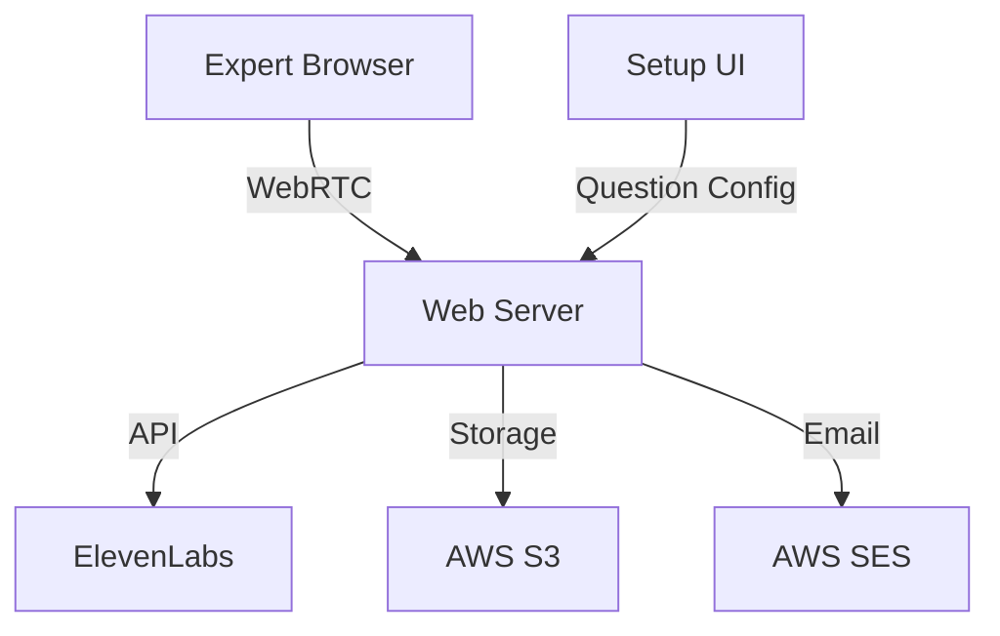

# InterviewBot - AI-Powered Expert Interview Platform

## Product Overview
InterviewBot is a lightweight web-based platform that facilitates automated voice interviews between an AI interviewer and subject matter experts. The platform uses ElevenLabs for voice synthesis and transcription, creating a natural conversational experience while capturing valuable expert knowledge through automated interviews. Each interview is conducted with a consistent AI voice personality, allowing for follow-up questions and branching conversation paths based on responses.

## Core Features

### 1. Interview Management
- Custom interview link generation for each expert
- Simple UI form for configuring interview questions, including:
  - Main questions
  - Follow-up questions
  - Branching logic based on responses
- Secure, single-use interview links
- Expected interview duration: 20-30 minutes
- Low volume handling (approximately 5 interviews per month)

### 2. Voice Interaction
- Real-time voice synthesis using ElevenLabs
- Consistent voice personality across all interviews
- Natural conversation flow with:
  - Dynamic follow-up questions
  - Branching dialogue paths
  - Appropriate pausing and turn-taking
- Voice selection via ElevenLabs options

### 3. Recording & Transcription
- High-quality audio recording of entire interview
- Post-interview transcription via ElevenLabs
- Automated email delivery of:
  - Audio recording (MP3)
  - Interview transcript
  - Interview metadata (JSON)
  - Plain text export (TXT)

### 4. Interview Experience
- Preparation phase:
  - Audio setup and testing
  - Preview of interview questions
  - Connection verification
- Interview controls:
  - Pause/Resume functionality
  - Audio level indicators
  - Progress tracking
- Clear, distraction-free interface

## Technical Requirements

### Frontend
- **Framework & Core Technologies**
  - React.js with TypeScript for type safety
  - Vite for build tooling and development
  - TailwindCSS for styling
  - React Router for navigation

- **Audio Processing**
  - WebRTC for real-time audio streaming
  - MediaRecorder API for local audio recording
  - Web Audio API for:
    - Audio visualization
    - Volume level monitoring
    - Background noise detection

- **State Management**
  - React Context for global state
  - Local storage for interview progress
  - Custom hooks for audio handling

- **UI Components**
  - Audio level visualizer
  - Progress indicator
  - Question preview panel
  - Pause/Resume controls
  - Error handling modals
  - Loading states and animations

- **Browser Compatibility**
  - Support for latest versions of Chrome, Firefox, Safari
  - Graceful fallbacks for unsupported features
  - Responsive design for desktop and tablet

### Backend
- **Core Server**
  - Node.js with Express
  - TypeScript for type safety
  - RESTful API design
  - WebSocket support for real-time communication

- **AWS Infrastructure**
  - EC2 for application hosting
  - S3 for audio storage
  - SES for email delivery
  - CloudWatch for monitoring
  - Route 53 for DNS management
  - ACM for SSL certificates

- **Database**
  - DynamoDB for interview data:
    - Interview configurations
    - Question sets
    - Session metadata
    - Completion status

- **Authentication & Security**
  - UUID-based interview links
  - Rate limiting
  - CORS configuration
  - Helmet.js for security headers
  - Environment variable management

- **File Processing**
  - Multer for file uploads
  - Sharp for image processing (if needed)
  - AWS SDK for S3 operations
  - Stream processing for large files

### APIs & External Services
- **ElevenLabs Integration**
  - Voice synthesis API implementation
  - Voice ID management
  - Error handling and retry logic
  - Rate limit monitoring
  - Backup voice configurations

- **AWS Services Integration**
  - S3 bucket management
  - SES email templates
  - CloudWatch logging
  - AWS SDK configuration

### Data Models

```typescript
// Interview Configuration
interface InterviewConfig {
  id: string;
  createdAt: Date;
  voiceId: string;
  questions: Question[];
  metadata: {
    expectedDuration: number;
    intervieweeEmail?: string;
    customFields: Record<string, string>;
  }
}

// Question Structure
interface Question {
  id: string;
  text: string;
  type: 'main' | 'followup' | 'branch';
  branchingLogic?: {
    condition: string;
    nextQuestionId: string;
  };
  followUps?: Question[];
}

// Interview Session
interface InterviewSession {
  id: string;
  configId: string;
  status: 'pending' | 'in-progress' | 'paused' | 'completed';
  startTime?: Date;
  endTime?: Date;
  currentQuestionId?: string;
  audioUrl?: string;
  transcriptUrl?: string;
}
```

### API Endpoints

```typescript
// Interview Management
POST   /api/interviews           // Create new interview
GET    /api/interviews/:id       // Get interview config
PUT    /api/interviews/:id       // Update interview config
DELETE /api/interviews/:id       // Delete interview

// Session Management
POST   /api/sessions            // Start new session
PUT    /api/sessions/:id        // Update session state
PUT    /api/sessions/:id/pause  // Pause session
PUT    /api/sessions/:id/resume // Resume session
POST   /api/sessions/:id/complete // Complete session

// Audio Processing
POST   /api/audio/upload        // Upload audio chunk
GET    /api/audio/:id           // Get processed audio
POST   /api/transcripts/generate // Generate transcript
```

### Development Environment
- **Required Tools**
  - Node.js v18+
  - npm or yarn
  - AWS CLI
  - Git
  - TypeScript 5.0+

- **Environment Variables**
```bash
# Server Configuration
PORT=3000
NODE_ENV=development
API_BASE_URL=http://localhost:3000

# AWS Configuration
AWS_REGION=us-east-1
AWS_ACCESS_KEY_ID=
AWS_SECRET_ACCESS_KEY=
AWS_S3_BUCKET=
AWS_SES_FROM_EMAIL=

# ElevenLabs Configuration
ELEVEN_LABS_API_KEY=
ELEVEN_LABS_VOICE_ID=

# Security
JWT_SECRET=
CORS_ORIGINS=http://localhost:5173
```

### Deployment Pipeline
- **Development**
  - Local development with hot reload
  - ESLint + Prettier for code quality
  - Jest for unit testing
  - Cypress for E2E testing

- **Staging**
  - Automated builds on PR
  - Integration tests
  - Performance testing
  - Security scanning

- **Production**
  - AWS CodePipeline
  - Blue-green deployment
  - Automated backups
  - Error monitoring

## User Flow

1. **Interview Setup**
   - Create interview questions via UI form
   - Configure branching logic
   - Select ElevenLabs voice
   - Generate and send unique interview link

2. **Expert Experience**
   - Click unique interview link
   - Review interview questions
   - Complete audio setup and testing
   - Begin interview with AI
   - Pause/Resume as needed
   - Complete interview

3. **Post-Interview**
   - Automatic processing of recording
   - Email delivery of all assets
   - Basic analytics (duration)

## Data Exports
- MP3 audio recording
- JSON format (interview metadata, Q&A structure)
- TXT transcript
- CSV summary (optional)

## Development Phases

### Phase 1 - MVP
- Basic interview functionality
- ElevenLabs integration
- Simple recording and email delivery
- Essential user interface
- Question preview
- Pause/Resume capability

### Phase 2 - Enhancement (Future)
- User authentication
- Advanced branching logic
- Enhanced analytics
- Interview dashboard
- Custom voice profiles

## Technical Architecture


## Success Metrics
- Interview completion rate
- Audio quality
- Average interview duration
- System reliability
- Expert satisfaction

## Maintenance
- Regular AWS infrastructure monitoring
- ElevenLabs API status tracking
- Basic error logging
- Weekly backups
